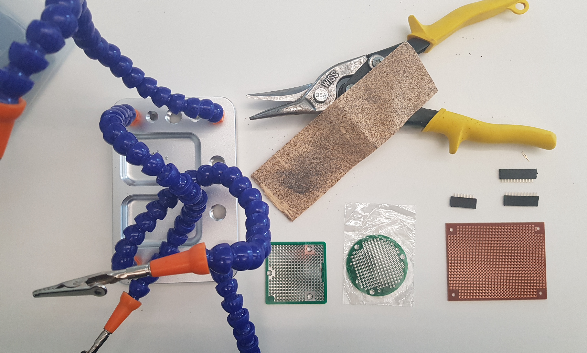
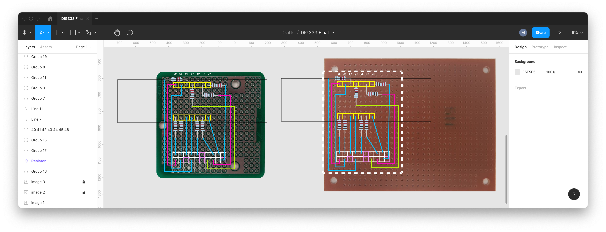
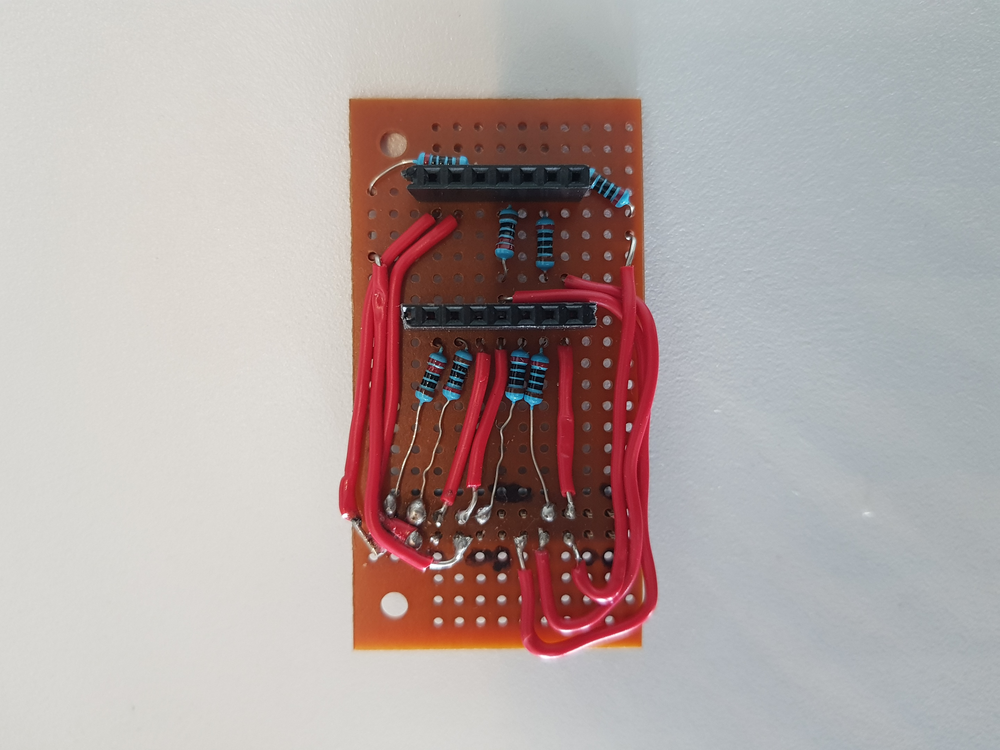
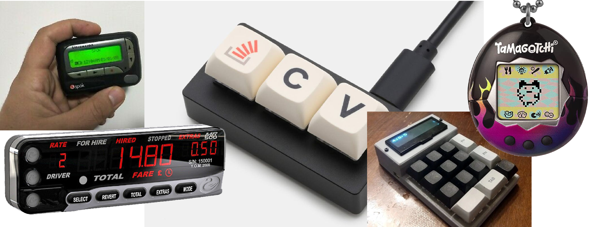
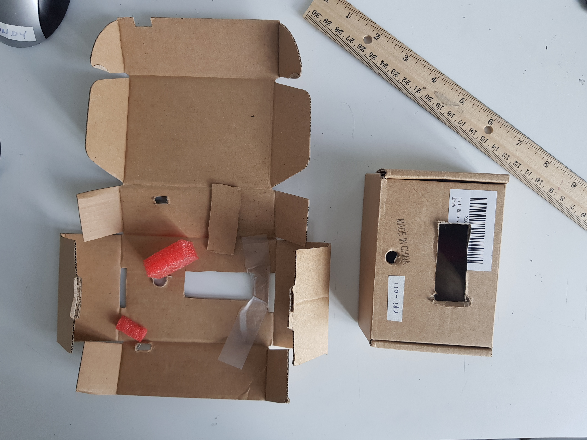
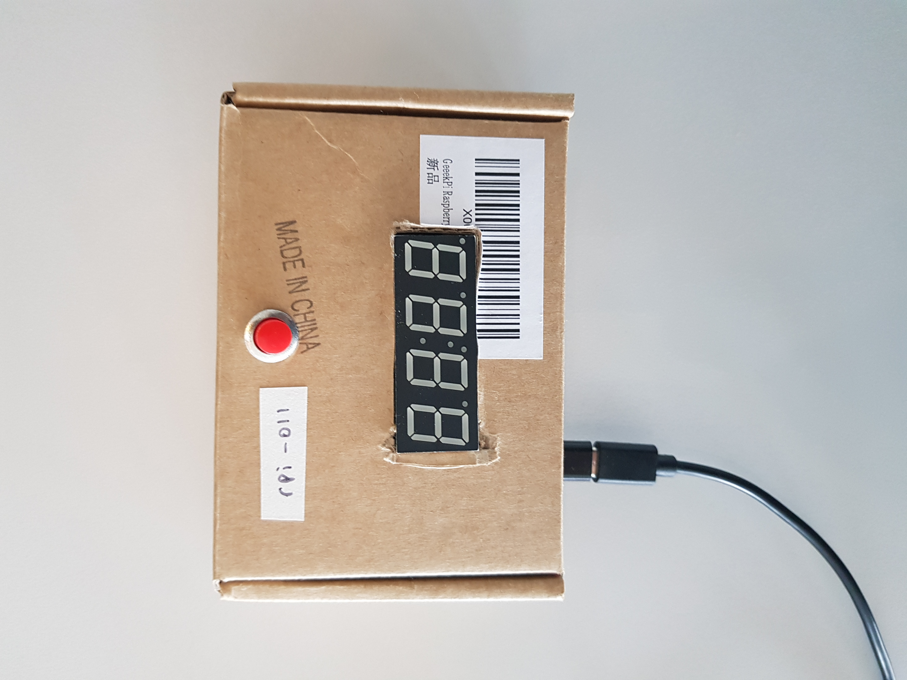

# How Long Until 5

## Artist's Statement

[WIP]

## Progress & Documentation

### Milestone 1

My first milestone was to strongly define the concept of my final project and to create the code underlying it. Although my final project relies on a 4-digit 7-segment display which I currently do not have, I was able to write [code](code/milestone-1.py) that outputs the correct time and formats it into a string that will be passed into the display through RPi GPIO. Beyond my first milestone goal, I was able to connect this to a single digit 7-segment display and cycle through the digits generated by the code above. This is a step towards Milestone 2, a functioning breadboard prototype.

https://user-images.githubusercontent.com/55297780/161658274-eab29da5-e5e0-481c-a640-2d292292e926.mp4

### Milestone 2

My second milestone built upon the sucess of the previous week. I was able to implement my 4-digit 7-segment display and adapt the [code](code/milestone-2.py) from my previous milestone to the new display. I was able to create a temporary circuit on a breadboard that executes the code when an input is activated and displays the time left until 5 PM followed by "til 5". Moving forward, I intend to make this circuit permanent by using a copper board and soldering the wires and resistors accordingly.

https://user-images.githubusercontent.com/55297780/163268999-0f769a45-20a5-4fa2-95fb-d2df99c8f564.mp4

### Milestone 3

My third milestone was to translate my breadboard circuit into a permanent, soldered circuit board. This proved more difficult than I had originally planned. Although I have currently not finished soldering a final circuit, I was able to make important decisions regarding what this would look like and, consequently, what the final form of my object will be. Below are some photos of the process, including a diagram of the final circuit made on Figma. I have also continued to update and cleanup my [code](code/milestone-3.py) as well as adding documentation to the file.

### Milestone 4

In the final two weeks, I picked up from my efforts in the previous milestone and finished the final version of my circuit, replicating the diagram. I also soldered the definitive version of my input switch. Additionally I used the display's packaging foam as a stabilizer to keep everything in place.

I focused on the physical form of my 'thing'. I looked into other gadgets with a similar form, that is, a simple display operated by one or few buttons.

#### Moodboard:

Finally, I moved into building my actual 'thing' by repurposing a cardboard box to fit my project.

Finally, here is a video of the final 'thing', functioning: